# From 0 to Working Car

In this step by step tutorial I will inlustrate you how to setup all our working environment.
## Hardware List
- Jetson Xavier NX Developer Kit
- SD card > 6 GB
## Download Card Image
1. Go to [the official NVIDIA download page](https://developer.nvidia.com/downloads)
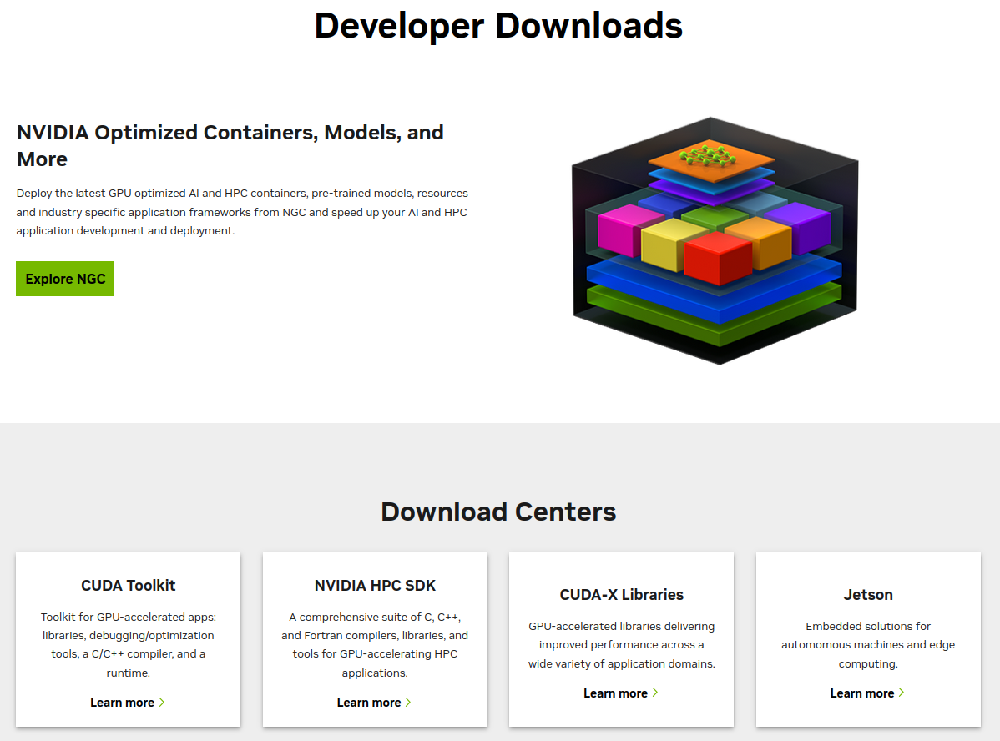
2. Click On *Jetson*
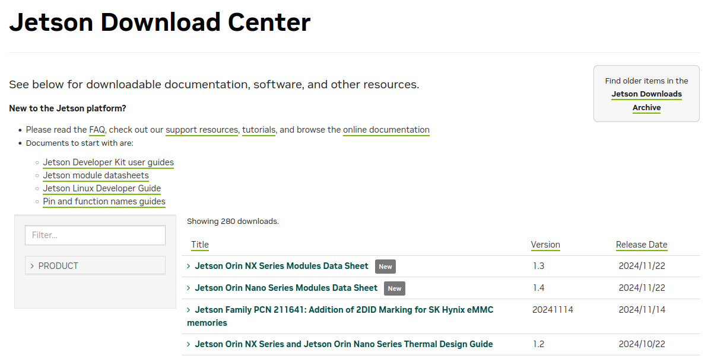
3. Inside *Filter...* search for:
```Jetson Xavier NX Developer Kit SD Card Image```
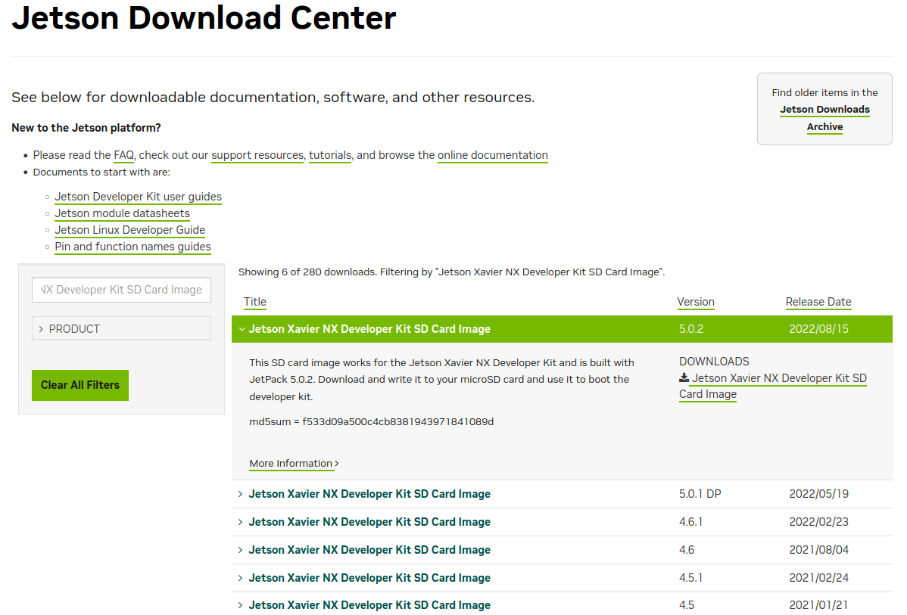
4. Download the last version
## Flash the Image on the SD
1. Completely format the sd card. Remove any previuosly present partition.

2. From [the official Balena Etcher website](https://etcher.balena.io/) download it.

3. Run *Balena Etcher* on Linux:
	- Unzip the downloaded file
	- Go inside:
		```balenaEtcher-linux-x64-*.**.**/balenaEtcher-linux-x64```
	- Double click on ```balena-etcher``` runnable
4. Select the previuosly downloaded image and the wanted SD card and run it
## Let's run the Jetson
1. Attach to the jetson:
	- Monitor
	- Keyboard
	- Mouse

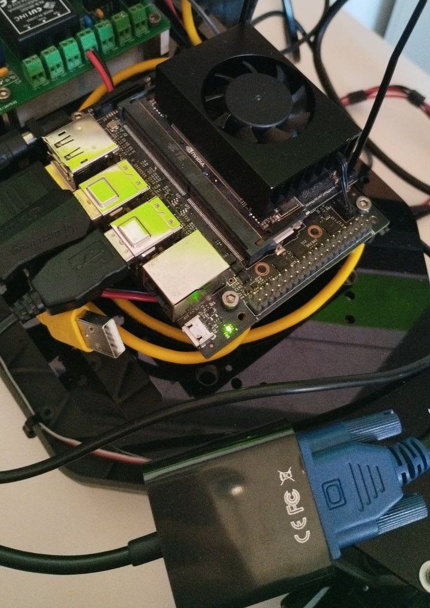
2. Insert the SD card inside the Jetson.
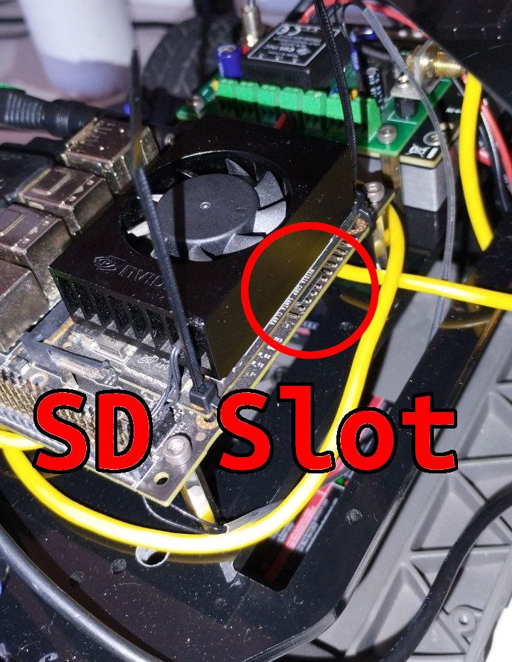
3. Power on the Jetson with a *[9; 20] V* input. A green led will turn on.
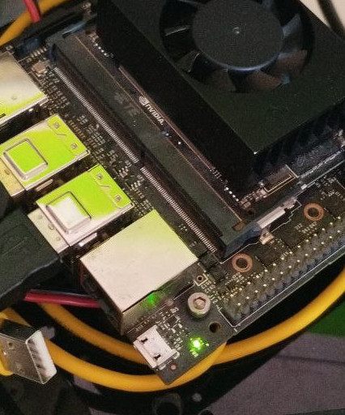
4. The jetson should automatically select SD as boot device, if not you can force it with F11 while starting. Anyway if not probably something wrong while flashing the SD. After the first boot you will end up with:
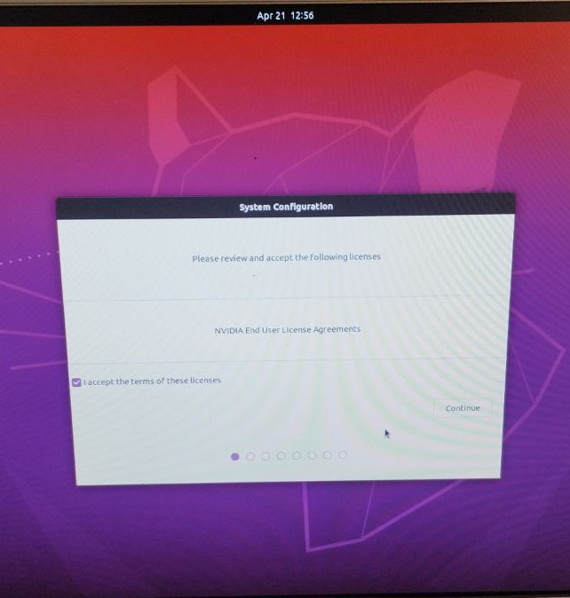
## Let's Set-Up The Jetson
1. Accept all the licenses
2. Put English as first Language
3. Italian as keyboard layout
4. Rome as time zone
5. Add a user:
	- username: ```ubm```
	- computer_name: ```ubm-<name_of_the_car>```
	- password: The usual one
	- Automatic Log in setted On

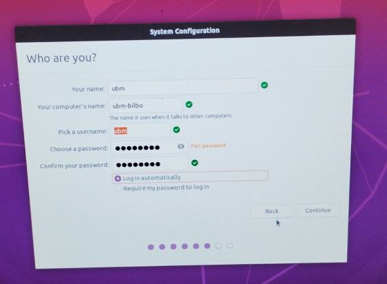
6. The Jetson is ready:
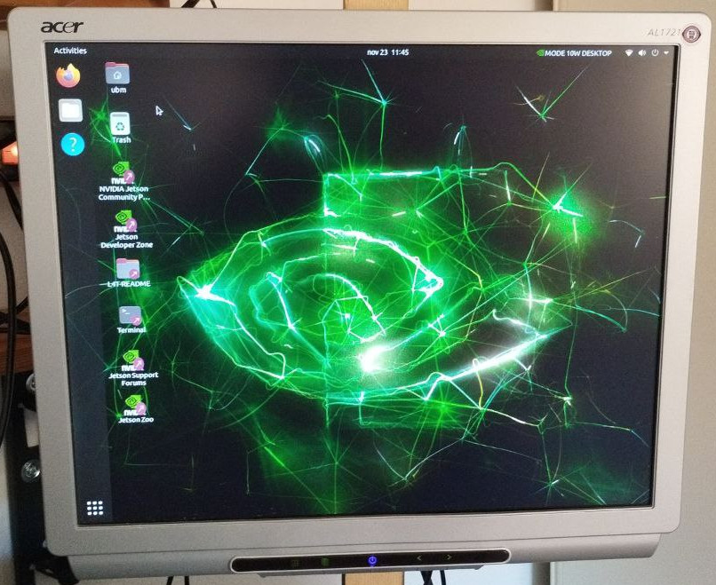
## Let's format the SSD
1. Search for Disk App.

2. Select the 500GB SSD and from th top right corner three dots select format.
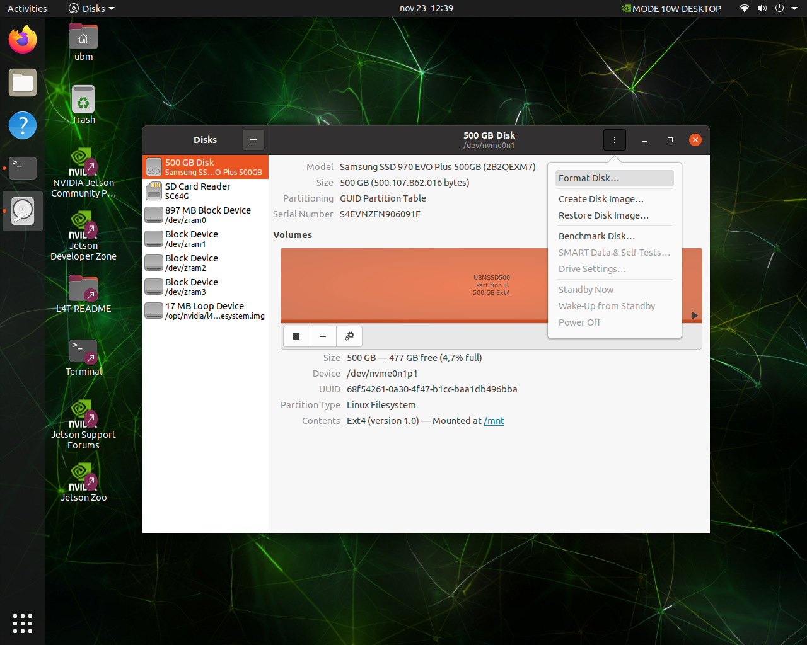
3. Format it leaving averything as default.
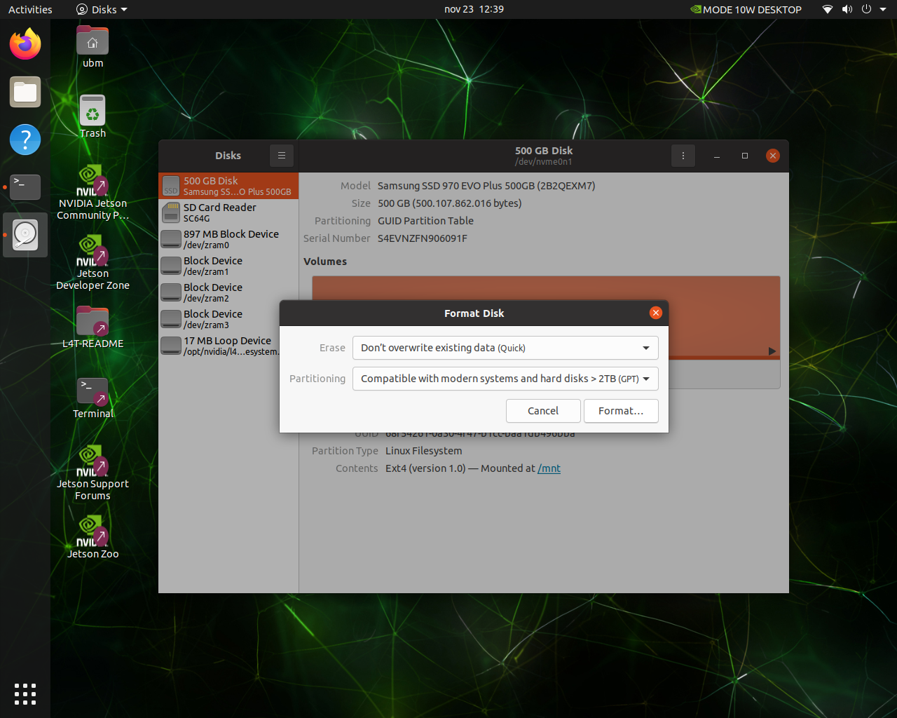
## Let's move the root to the SSD
1. Open a Terminal
2. ```cd ~/Downloads```
3. ```git clone https://github.com/jetsonhacks/rootOnNVMe.git```
4. ```cd rootOnNVMe```
5. ```./copy-rootfs-ssd.sh```
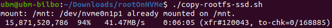
6. ```./setup-service.sh```
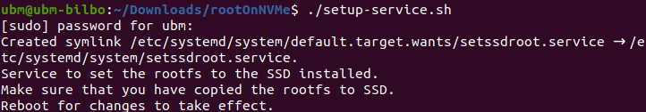
7. ```sudo reboot now```
## Let's Update all the Packages
1. Open a Terminal
2. ```sudo apt update```
3. ```sudo apt upgrade```
4. ```sudo reboot now```
## Let's create a Swapfile
1. ```sudo fallocate -l 4G /var/swapfile```
2. ```sudo chmod 600 /var/swapfile```
3. ```sudo mkswap /var/swapfile```
4. ```sudo swapon /var/swapfile```
5. ```sudo bash -c 'echo "/var/swapfile swap swap defaults 0 0" >> /etc/fstab'```
## Let's Install some Basic Software
1. ```sudo apt install nano python3.8-full python3-pip tree```
2. ```sudo pip3 install -U jetson-stats```
3. ```sudo reboot now```
4. Now if you run ```jtop```:
## Let's add udev rules
1. ```sudo -s```
2. ```echo 'KERNEL=="ttyACM[0-9]*", ACTION=="add", ATTRS{idVendor}=="15d1", MODE="0666", GROUP="dialout", SYMLINK+="sensors/hokuyo"' >> /etc/udev/rules.d/99-hokuyo.rules```
3. ```echo 'KERNEL=="ttyACM[0-9]*", ACTION=="add", ATTRS{idVendor}=="0483", ATTRS{idProduct}=="5740", MODE="0666", GROUP="dialout", SYMLINK+="sensors/vesc"' >> /etc/udev/rules.d/99-vesc.rules```
4. ```sudo udevadm control --reload-rules```
5. ```sudo udevadm trigger```
6. ```sudo reboot now```
7. Check that inside */dev/sensors* there is *vesc*

## Let's Install ROS2 foxy

1. ```sudo locale-gen en_US en_US.UTF-8```
2. ```sudo update-locale LC_ALL=en_US.UTF-8 LANG=en_US.UTF-8```
3. ```export LANG=en_US.UTF-8```
4. ```sudo apt update && sudo apt install curl -y```
5. ```sudo curl -sSL https://raw.githubusercontent.com/ros/rosdistro/master/ros.key -o /usr/share/keyrings/ros-archive-keyring.gpg```
6. ```echo "deb [arch=$(dpkg --print-architecture) signed-by=/usr/share/keyrings/ros-archive-keyring.gpg] http://packages.ros.org/ros2/ubuntu $(. /etc/os-release && echo $UBUNTU_CODENAME) main" | sudo tee /etc/apt/sources.list.d/ros2.list > /dev/null```
7. ```sudo apt update```
8. ```sudo apt upgrade```
9. ```sudo apt install ros-foxy-desktop python3-argcomplete```
10. ```sudo apt install ros-dev-tools```
Let's try if ros2 is working:
11. ```source /opt/ros/foxy/setup.bash```
12. ```ros2 run demo_nodes_cpp talker```
Expected Output:
```
ubm@ubm-bilbo:~$ ros2 run demo_nodes_cpp talker
[INFO] [1732365939.572103752] [talker]: Publishing: 'Hello World: 1'
[INFO] [1732365940.571954330] [talker]: Publishing: 'Hello World: 2'
[INFO] [1732365941.571874272] [talker]: Publishing: 'Hello World: 3'
[INFO] [1732365942.571906233] [talker]: Publishing: 'Hello World: 4'
```
13. ```sudo apt install python3-colcon-common-extensions```
14. ```sudo apt install python3-bloom python3-rosdep fakeroot debhelper dh-python```
15. ```sudo rosdep init```
16. ```rosdep update```
```
reading in sources list data from /etc/ros/rosdep/sources.list.d
Hit https://raw.githubusercontent.com/ros/rosdistro/master/rosdep/osx-homebrew.yaml
Hit https://raw.githubusercontent.com/ros/rosdistro/master/rosdep/base.yaml
Hit https://raw.githubusercontent.com/ros/rosdistro/master/rosdep/python.yaml
Hit https://raw.githubusercontent.com/ros/rosdistro/master/rosdep/ruby.yaml
Hit https://raw.githubusercontent.com/ros/rosdistro/master/releases/fuerte.yaml
Query rosdistro index https://raw.githubusercontent.com/ros/rosdistro/master/index-v4.yaml
Skip end-of-life distro "ardent"
Skip end-of-life distro "bouncy"
Skip end-of-life distro "crystal"
Skip end-of-life distro "dashing"
Skip end-of-life distro "eloquent"
Skip end-of-life distro "foxy"
Skip end-of-life distro "galactic"
Skip end-of-life distro "groovy"
Add distro "humble"
Skip end-of-life distro "hydro"
Skip end-of-life distro "indigo"
Add distro "iron"
Skip end-of-life distro "jade"
Add distro "jazzy"
Skip end-of-life distro "kinetic"
Skip end-of-life distro "lunar"
Skip end-of-life distro "melodic"
Add distro "noetic"
Add distro "rolling"
updated cache in /home/ubm/.ros/rosdep/sources.cache
```
## Let's Create and Set-Up our Workspace
1. ```cd $HOME```
2. ```rm -rf Music Pictures Public Templates Videos Documents```
3. ```sudo usermod -aG input ubm```
4. ```mkdir Software```
5. ```mkdir -p f1tenth_ws/src```
6. ```cd f1tenth_ws```
7. ``` colcon build```
```
ubm@ubm-bilbo:~/f1tenth_ws$ colcon build
                     
Summary: 0 packages finished [1.11s]
```
5. ```ssh-keygen```
Just press enter and leave everything as default
```
Generating public/private rsa key pair.
Enter file in which to save the key (/home/ubm/.ssh/id_rsa): 
Enter passphrase (empty for no passphrase): 
Enter same passphrase again: 
Your identification has been saved in /home/ubm/.ssh/id_rsa
Your public key has been saved in /home/ubm/.ssh/id_rsa.pub
The key fingerprint is:
SHA256:sdmSu2w/krGwt23PJB9jO0bYyATguRf+6u1x7d+Xq3U ubm@ubm-bilbo
The key's randomart image is:
+---[RSA 3072]----+
|      ..         |
|     . ..        |
|      o o.       |
|       o B.      |
|      . So.+     |
|      ...++ o.   |
|       o.++.* ..E|
|      ..*=oOo=..+|
|       +**=+=ooo=|
+----[SHA256]-----+
```
6. ```cat ~/.ssh/id_rsa.pub```
```
ssh-rsa AAAAB3NzaC1yc2EAAAADAQABAAABgQDN7+Bvuoxp3m94JyjrbjC4HytEGS2a4Jpb3GAvC5NG+8lfm9mrLDdzY/dxlV1mpm56WNK/TLJOwCOcN/fg3PWWbqsrY+sosUtD8auAQs66QiooLDeN2fOoU6oDCLvLpLO6ozIG/ZgeG18nTqcNZR66LQJW3/gsk8w9nkSnii0/dsyF7K5X33/x8R7HecAnT6H2fI10avOH9FkF39g+7L0Ycr2Q7r22LQ/2CSazYLqSb762oExGJ/YdhYxFYmgzQ5Jb54GDdYoghv54zYGEb5ubeVuFnkAtLeGPzANdX0r8rwsn2aZEMNz01E3gr8GCccVa0xApIYUUAGD3QHuw0JALu3o0aRE3CHiFRCJb6hx23qAf872oWKHay/HdwPqw/maVNa2bdYxW70G7jsAvH3hbh0dG73Nro+WQdF38VoxUYYZ1+yTf1QetQSZ/3o/5X+7lCdbfoDygYJcVAuEm2RvTgmK0Epcyq1psEgNd0wsQzKXCeKOnoCk7V1qpWeJ1IyM= ubm@ubm-bilbo
```
7. Copy the output on the *SSH and GPG keys* of the github *ubm-device* account. Ask for the credentials.
8. ```cd ~/```
6. ```git clone git@github.com:ubm-driverless/ubm-f1tenth.git repo```
7. ```cat ~/repo/updated_bashrc.bash >> ~/.bashrc```
## Let's Build f1tenth_system
1. ```ln -s /home/ubm/repo/f1tenth_system/ /home/ubm/f1tenth_ws/src/```
2. ```cd /home/ubm/f1tenth_ws/src/```
3. ```git clone https://github.com/f1tenth/ackermann_mux.git```
4. ```cd /home/ubm/f1tenth_ws```
5. ```rosdep update --rosdistro="foxy"```
6. ```rosdep install --from-paths src -i -y```
7. ```colcon build```


## Let's Install Vnc
1. ```sudo apt install Xvfb x11vnc lxsession```
2. ```sudo nano /etc/systemd/system/vnc.service```
3. Write inside the file:
```
[Unit]
Description=Start Xvfb, LXDE, and x11vnc server
After=network.target graphical.target
Wants=network.target graphical.target

[Service]
Type=forking
Environment=DISPLAY=:99
ExecStart=/bin/bash -c "Xvfb :99 -screen 0 1024x768x24 & echo $! > /tmp/xvfb.pid; lxsession & echo $! > /tmp/lxsession.pid; x11vnc -display :99 -forever -nopw -xkb & echo $! > /tmp/x11vnc.pid"
ExecStop=/bin/bash -c "kill -9 $(cat /tmp/xvfb.pid) $(cat /tmp/lxsession.pid) $(cat /tmp/x11vnc.pid)"
PIDFile=/tmp/xvfb.pid
Restart=always
User=ubm
WorkingDirectory=/home/ubm
TimeoutStopSec=10

[Install]
WantedBy=multi-user.target
```
4. ```sudo systemctl daemon-reload```

5. ```sudo systemctl start vnc.service```

## Let's Install JetsonGPIO

1. ```cd /home/ubm```
2. ```git clone https://github.com/pjueon/JetsonGPIO```
3. ```cd JetsonGPIO```
4. ```mkdir build && cd build```
5. ```cmake .. ```
6. ```sudo cmake --build . --target install```

