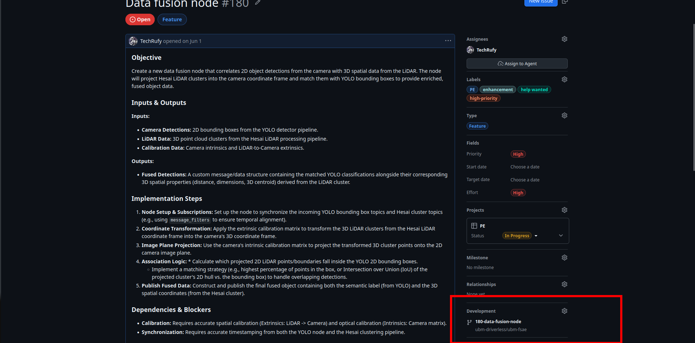

# General Workflow for Github

To ensure a standard of working in the team, in this guide will be exposed the general steps for working in team.

1. **Task assignement** : The first step of working is knowing what you have to do, usually the division manager will give you a task, however if you have some idea you can talk with the manager and discuss it, in any case before going on with the steps, be sure that the manager knows about it.

2. **Issue Creation** : Before starting working on the code, you should create an issue on github that explain in detail the reason for the tasks, on or more solution and the final objective of the issue

3. **branch** : When the issue is completed you can start working on the task in a separate branch from the main, from the page of the issue you can directly create a branch that has as name the name of the issue.
 

4. **Start Working** : With your branch created you can directly start working on the code on your local pc, remember to do first a `git pull` and `git checkout <name_branch>` to be sure to be working on the right branch.

5. **Recomendation** : Try to do frequent but relevant commit, the more trackable the work is the easier to debug; if you are working in group check for update on the branch before start writing code; Write everything in english from the documentation to the commit name.

6. **Merge** : When your work is finished talk with the manager or a superior for the merge. After the work is approved you can open a pull request, and after resolving the conflicts, you can merge everything and close the issue.

7. **Done** : After the merge your tasks is generally completed, sometime you would need to test your code after the merge, but generally you will have to do most of the test before it.

