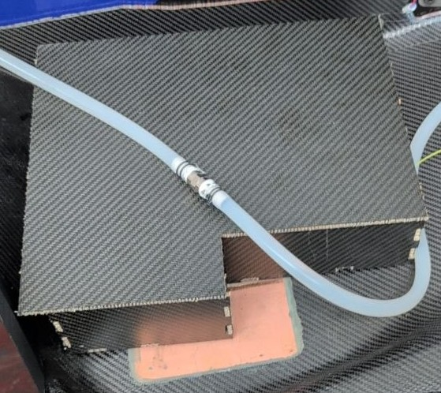
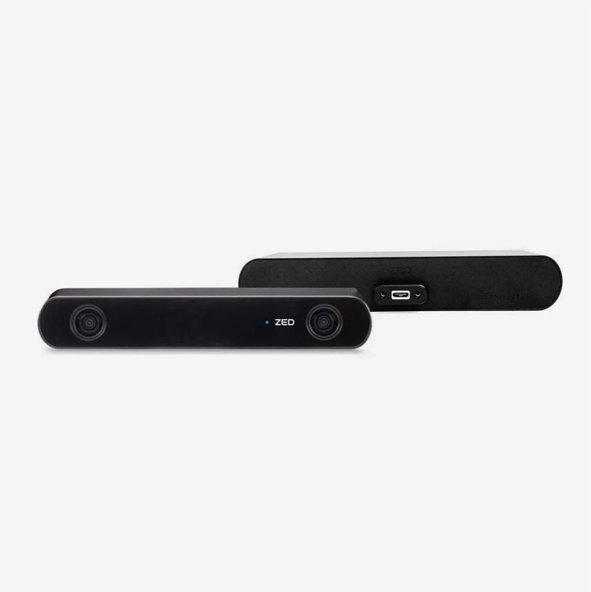
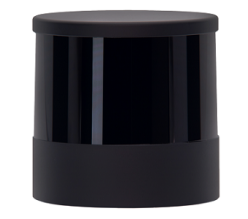

# FSAE Hardware Documentation

## Disclaimer 

This document is intended to serve as a simple guideline for new members, not as a comprehensive documentation of the entire car's hardware. Therefore, only the most important details will be presented.

## Warning 

This document is a work in progress. If you fnd any errors, or if you believe something is missing or unclear, please report them. 

## Basic guidelines

Before touching anything in the car asks a manager or the CTO, almost every in it is really expensive, so avoid touching anything if not instructed to do so.

## ASU (Autonomous System Unit) 

The main hardware of the DV division is the Autonomous System Unit (ASU), this is the PC on which all the stack run during testing and racing. It is a custom build pc with custom cooling, the components are the following:

### Components of the ASU

| Component | Specification |
| :--- | :--- |
| **Motherboard** | ASUS Z790-I |
| **CPU** | Intel Core i7-12700K |
| **RAM** | G.SKILL 16GB DDR5 7200MHz |
| **GPU** | ASUS DUAL-RTX4060TI-O8G |
| **SSD** | Samsung MZ-V9P1T0BW |
| **Power Supply** | HDPLEX 500W HiFi DC-ATX |

### Cooling System

| Part | Specification |
| :--- | :--- |
| **Radiator** | Alphacool 14172 |
| **Water Pump** | WCP D5-VARIO |
| **Reservoir** | Stealkey UNI 80 |

### Case

All the components are in a case composed by plates of laminated carbon.

### Components position in the case

The Disposition of the element in the case is the following:

Due to the limited dimension of the case and the cooling system of the car other disposition are not possible.

## Sensors

### ZED camera

One of the main sensor of the DV is the ZED camera i2, this is a stereo camera that we use in combination with Yolo to identify the cone on the track.

Most of the information on the camera, can be directly found in the README of the driver in the repo Consulta la [zed2_driver](https://ubm-driverless.github.io/ubm-docs/rosdoc2_generated/ubm-fsae/zed2_driver/).

### Lidar

The second main sensor is the lidar, this device operate on the Time-of-Flight (ToF)
principle, which measures the distance to a target by analyzing the temporal delay of light pulses, combining this with the rotating element the sensors create a cloud of point that can be use to analyze the surrounding enviroment.

During the last years we changed the lidar that we used, the first one was the The SICK multiScan 165

   
*Lidar SICK multiScan 165*

the second one, that we used during the year 2025/26 is the Hesai OT128

  
*Lidar Hesai OT128*

The Ot128 was borrowed from the professor Mattoccia, so it was not a stable one, during the year 2026/27 should arriva a new SICK lidar.

